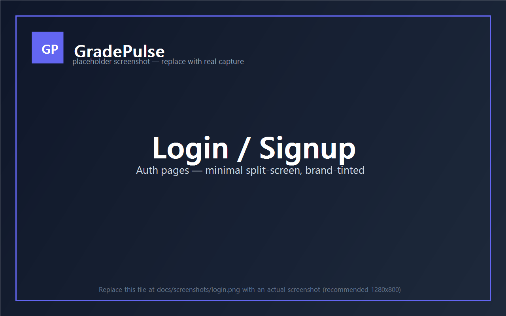
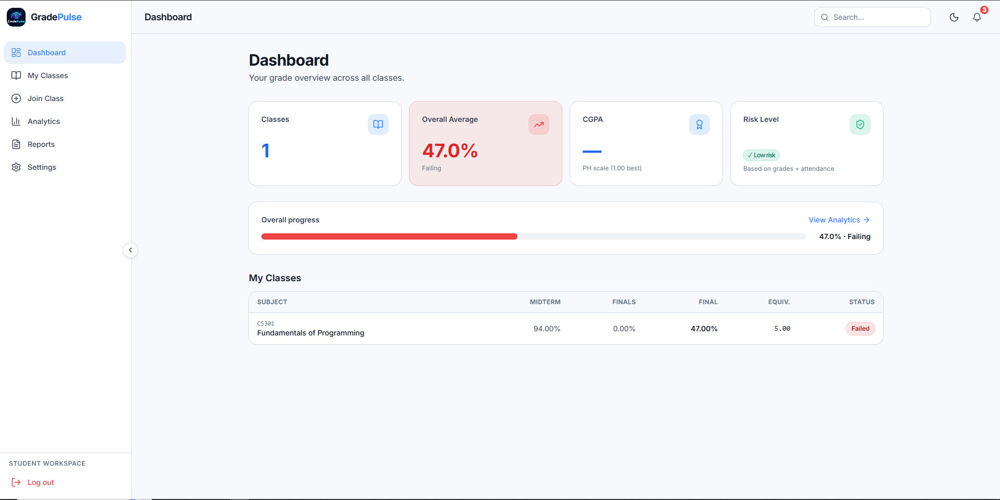
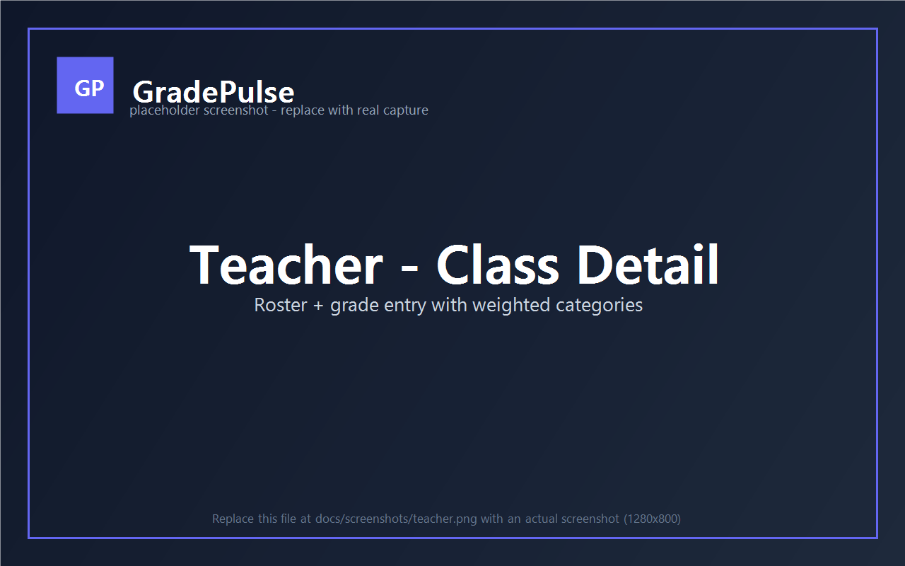
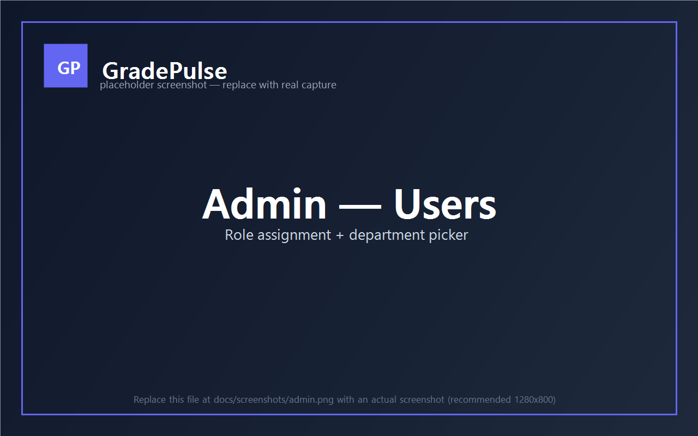
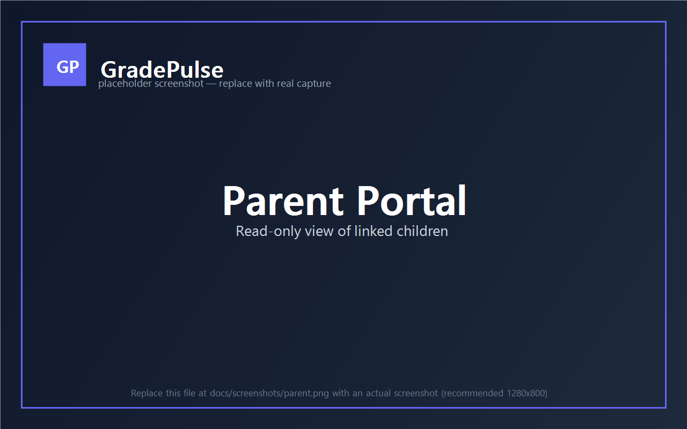
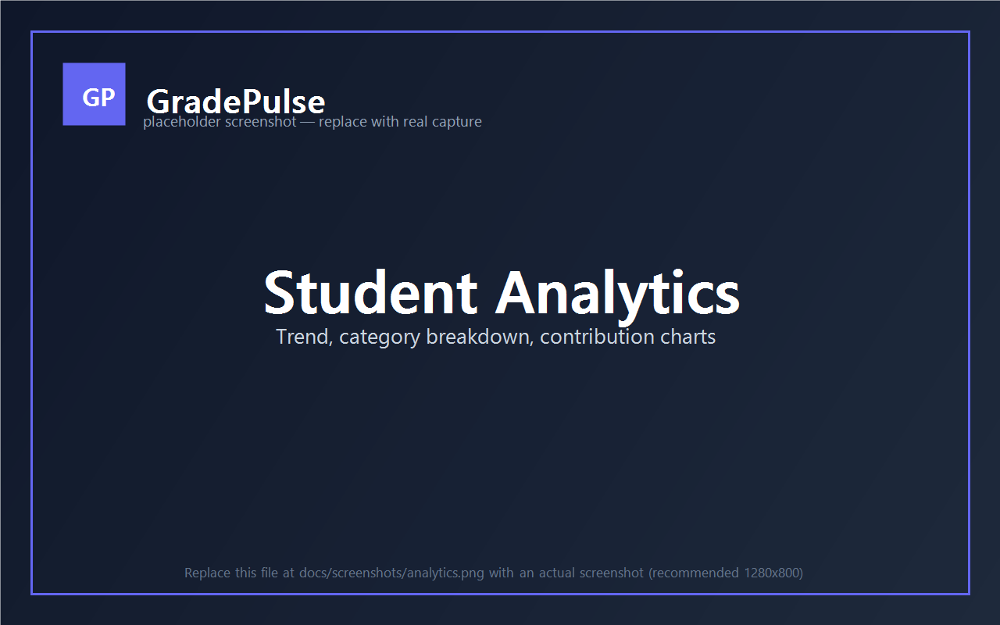

# GradePulse

> University grade-transparency platform with role-based dashboards for students, teachers, parents, department heads, and admins. Real-time notifications, attendance tracking, grade-change approval workflows, bias-signal analytics, and a profile-completion flow — all backed by Postgres RLS so each role only ever sees what it's allowed to.

[](https://react.dev/)
[](https://www.typescriptlang.org/)
[](https://vitejs.dev/)
[](https://tailwindcss.com/)
[](https://supabase.com/)
[](https://gradepulse-dun.vercel.app/)
[](https://github.com/JRAF2-0/GradePulse/actions/workflows/ci.yml)
[](#license)

**🔗 Live demo:** [gradepulse-dun.vercel.app](https://gradepulse-dun.vercel.app/)

---

## Screenshots

_All shown in dark mode (default). Light mode toggle available in the topbar._

| Login                                         | Student dashboard                                       |
| --------------------------------------------- | ------------------------------------------------------- |
|           |       |

| Teacher class detail                                       | Admin Users                                          |
| ---------------------------------------------------------- | ---------------------------------------------------- |
|       |            |

| Parent portal                                  | Analytics                                                 |
| ---------------------------------------------- | --------------------------------------------------------- |
|   |        |

---

## Features by role

**Student** — bento dashboard with CGPA, Dean's List badge, risk level, and overall-average progress bar. Per-class breakdown with weighted categories, attendance summary, comment threads, and one-click grade appeals. Trend / category / contribution charts under Analytics. Semester transcript PDF download.

**Teacher** — class roster with risk-per-student badges, grade entry with category weights (must sum to 100% before scores can be entered), per-cell comments, attendance tracking with date picker, and post-finalize grade-change requests that route to the Department Head for approval.

**Department Head** — approval queue for finalized-period grade changes from teachers in their department, plus a bias-signals dashboard showing statistical anomalies (below-dept-avg classes, section divergence, high-fail-rate classes, suspicious entry bursts).

**Parent** — read-only view of linked students' grades, attendance, finalized period grades, and notifications. Multiple children supported per parent via the admin's Parent Links page.

**Admin** — user directory with role assignment (including department picker for Department Heads), audit log of every grade change, system-wide appeals, bias signals across all departments, and CRUD for departments, subjects, classes, and parent links.

**Shared** — Supabase real-time notification bell, dark/light theme with cool-tinted dark palette, sectioned profile page with avatar upload (Supabase Storage + per-user RLS), structured address fields, civil-status / nationality / emergency contact, and a "Profile completeness X/13" progress meter.

---

## Architecture at a glance

- **Frontend:** React 18 + TypeScript (strict) + Vite + Tailwind CSS with CSS-variable theme tokens. Route-based code splitting via `React.lazy` (main bundle ~410 kB, per-route chunks).
- **Backend:** Supabase Postgres + Auth + Storage + Realtime. All authorization in the database via **Row Level Security** policies and **SECURITY DEFINER** helper functions — every role's reads/writes are enforced by RLS, not trust-the-client.
- **Schema:** 22 idempotent SQL migrations (kept locally, not in this repo). Tables: users, students, teachers, departments, classes, subjects, grade_categories, grade_items, scores, attendance, appeals, grade_change_requests, score_comments, notifications, parent_students, audit_logs. RPCs for grade computation, CGPA, Dean's List eligibility, bias signals, risk level, attendance summary.
- **Auth flow:** signup → admin assigns role → role-specific banner prompts user to fill their student/teacher profile → RoleGuard enforces route access per role.
- **Theming:** Single source of truth in `src/index.css` (RGB-triplet tokens consumed via Tailwind's `rgb(var(--token) / <alpha-value>)` colors). Dark mode is the default; pre-paint inline script in `index.html` prevents flash-of-wrong-theme.

---

## Tech stack

| Layer        | Tech                                                                                                 |
| ------------ | ---------------------------------------------------------------------------------------------------- |
| UI           | React 18, TypeScript 5 (strict), Vite 5, Tailwind CSS 3, lucide-react icons, Recharts                |
| State        | React Context (Auth + Theme), local component state                                                  |
| Backend      | Supabase: Postgres, Auth, Storage (avatars), Realtime, RLS, SECURITY DEFINER RPCs                    |
| PDFs         | jsPDF + jspdf-autotable (transcripts, reports)                                                       |
| Tooling      | ESLint + Prettier, GitHub Actions CI (lint + typecheck + build), Vercel preview deploys              |
| Hosting      | Vercel (frontend), Supabase Cloud (backend), security headers via `vercel.json`                      |

---

## Documentation

- [Roles & bias detection](./docs/ROLES.md) — what each role does and how the platform surfaces fairness signals.

---

## Quick start

```bash
# 1. Clone
git clone https://github.com/JRAF2-0/GradePulse.git
cd GradePulse

# 2. Install
npm install

# 3. Configure Supabase
cp .env.example .env.local
# Fill in VITE_SUPABASE_URL and VITE_SUPABASE_ANON_KEY from
# https://supabase.com/dashboard → your project → Settings → API.

# 4. Apply schema migrations to your Supabase project via the SQL Editor
# (Migration files are kept locally — request them from the repo owner
# if you're forking, or generate fresh ones for your own schema.)

# 5. Run dev server
npm run dev          # http://localhost:5173

# 6. Bootstrap the first admin
# Sign up via the app, then in Supabase SQL editor:
#   update public.users set role = 'admin' where email = 'you@example.com';
```

### Scripts

| Command                | Purpose                                                |
| ---------------------- | ------------------------------------------------------ |
| `npm run dev`          | Vite dev server with HMR                               |
| `npm run build`        | TypeScript build + Vite production bundle              |
| `npm run preview`      | Serve the production build locally                     |
| `npm run lint`         | ESLint with `--max-warnings 0` (run in CI)             |
| `npm run lint:fix`     | ESLint auto-fix                                        |
| `npm run typecheck`    | `tsc --noEmit`                                         |
| `npm run format`       | Prettier write across `src/`                           |
| `npm run format:check` | Prettier check (no write)                              |

---

## Project structure

```
.
├── src/
│   ├── components/          # Sidebar, Topbar, StatTile, ErrorBoundary,
│   │                        # PersonalInfoCard, AvatarUploader, RoleProfileBanner,
│   │                        # NotificationBell, RiskBadge, Logo, RoleGuard, …
│   ├── context/             # AuthContext, ThemeContext
│   ├── hooks/               # useStudentClasses, useTeacherClasses, useAppeals,
│   │                        # useNotifications, useStudentClassDetail, useClassDetail
│   ├── pages/
│   │   ├── auth/            # Login, Signup, ResetPassword
│   │   ├── student/         # Dashboard, Classes, ClassDetails, JoinClass, Analytics, Reports
│   │   ├── teacher/         # Dashboard, Classes, CreateClass, ClassDetails, Reports
│   │   ├── admin/           # Dashboard, Users, Departments, Subjects, Classes,
│   │   │                    # ParentLinks, Appeals, AuditLogs
│   │   ├── parent/          # Dashboard, StudentView
│   │   ├── department-head/ # Dashboard, Approvals
│   │   ├── Profile.tsx, Pending.tsx, BiasSignals.tsx
│   ├── types/database.ts    # DbUser, DbStudent, DbTeacher, …, RPC signatures
│   ├── utils/               # errorMessage, conversionTable, pdfExport
│   ├── lib/supabase.ts      # Typed Supabase client
│   ├── App.tsx              # Lazy-loaded routes + Suspense + ErrorBoundary
│   ├── main.tsx             # ReactDOM root
│   └── index.css            # Theme tokens + component classes (.btn-*, .card, .input, .badge-*)
├── .github/workflows/ci.yml # Lint + typecheck + build
├── vercel.json              # Security headers + SPA rewrite
├── tailwind.config.js       # darkMode: 'class' + semantic colors from CSS vars
├── tsconfig.json            # strict + noUnusedLocals + noUnusedParameters
└── .eslintrc.cjs / .prettierrc
```

---

## Engineering notes

- **All authorization is in the database.** Every page-level guard is just for UX; the real enforcement is Postgres RLS. RPCs use `SECURITY DEFINER` with pinned `search_path` (anti search-path hijack) and explicit actor-role checks for privileged operations like lock-bypass on finalized grades.
- **Dark mode was the source of a real bug worth a story.** Body-level `text-slate-900` from `index.html` was overriding the theme tokens via class-selector specificity, making table text dark on dark in dark mode. Fixed by removing the inline class and letting `body { color: rgb(var(--content)); }` take over, plus a pre-paint script in `<head>` to avoid flash of wrong theme.
- **TanStack Query was considered and skipped** for the V2 scope — direct Supabase calls with local `useEffect` worked fine for the data volumes involved, and adding it everywhere would have churned ~6 hooks without delivering proportional UX wins. Documented as a fast-follow.
- **Migrations are local-only.** The SQL files (V1 + V2 + 0020–0022 for the profile system) live on the working tree but aren't published to GitHub. This keeps the schema source-of-truth with the repo owner while still allowing reproducible setups.

---

## License

MIT — see commit history. Contributions welcome via pull request.
